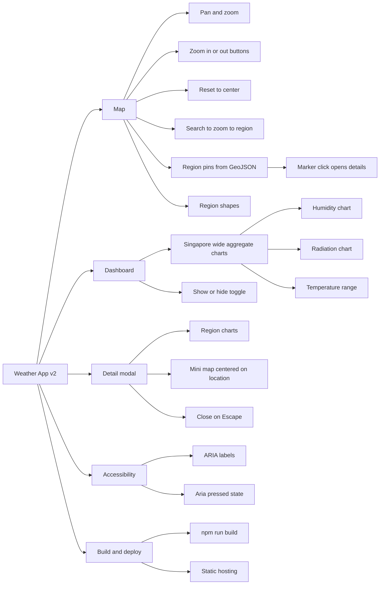

# React + TypeScript + Vite

This template provides a minimal setup to get React working in Vite with HMR and some ESLint rules.

Weather App v2 (Singapore)
=================================

An interactive weather dashboard for Singapore built with React, Leaflet, Tailwind CSS, and Recharts. It renders an OSM map with clickable pins for every Singapore region, a search bar to zoom to regions, custom zoom controls including a reset-to-center button, and a right-side dashboard showing Singapore-wide aggregates. Clicking any pin opens a detail modal with charts and a mini-map.

Key Features
- Interactive map (Leaflet + react-leaflet)
  - Pins auto-generated from `src/data/regionsGeo.json` (one per region)
  - Custom controls: Zoom In/Out and Reset-to-Center (animated `flyTo`)
  - Search bar to zoom to a region by name
  - Optional dashboard toggle button in the search bar
- Right-side charts (Recharts)
  - Default shows Singapore-wide aggregates across all regions
  - When a pin is clicked, a large modal opens with detailed charts for that region
- Smooth UI (Tailwind CSS + glassmorphism panels)

## Feature Diagram



Tech Stack
- React 18 + TypeScript + Vite 7
- Leaflet + react-leaflet
- Recharts
- Tailwind CSS

Project Structure (high-level)
```
src/
  components/
    MapPanel.tsx      # Map, search pill, zoom/reset, pins, dashboard toggle
    ChartsPanel.tsx   # Recharts composites for humidity/radiation and temperature range
    DetailModal.tsx   # Expanded charts + mini map for the selected location
    SearchBox.tsx     # Reusable command-palette style search
  data/
    regionsGeo.json   # GeoJSON of SG regions (used to place pins)
    mock.ts           # Demo data generator + types
  main.tsx            # App bootstrap + Leaflet CSS import
  App.tsx             # App shell, dashboard overlay, state wiring
```

How the Data Works
- Each region pin is computed from the GeoJSON polygon’s bounds center.
- Demo time-series are generated in `src/data/mock.ts` via `generateSeries()`.
- The main dashboard computes a Singapore-wide aggregate series (averages across all regions by date).
- To switch to a real API later, replace the generated series with fetched values and keep the shape `{ date, humidity, radiation, tMin, tMax }`.

Getting Started
Prerequisites
- Node.js 18+
- npm (or pnpm/yarn)

Install
```bash
npm install
```

Run (development)
```bash
npm run dev
```
The app will start on a local Vite dev server. Open the printed URL in your browser.

Build for production
```bash
npm run build
npm run preview   # optional: preview the built app locally
```

Lint
```bash
npm run lint
```

Usage
- Pan and zoom the map with mouse/touch. Use +/− in the search bar for convenience.
- Click the person icon to reset view back to Singapore (animated fly-to).
- Use the search box to jump to any region.
- Click a pin to open the details modal with charts and a mini-map.
- Toggle the right-side dashboard with the grid icon.

Accessibility & Keyboard
- Escape closes the details modal.
- Buttons have `aria-label`s; the dashboard toggle reports `aria-pressed`.

Troubleshooting
- Map not interactive or unclickable: ensure the map container is not behind overlays. We set `z-0` for the map and high z-index for overlays.
- Leaflet icons in Vite: handled by explicit URL imports in `MapPanel.tsx`.
- Default Leaflet zoom controls are hidden via CSS because we provide custom ones.

Deploying
- The app is a static site. You can deploy to Vercel/Netlify/GitHub Pages easily:
  - Build: `npm run build`
  - Deploy the `dist/` folder.

Contributing
- PRs are welcome. Keep TypeScript types, run `npm run lint`, and ensure the app builds.

License
- MIT (or your preferred license).

Currently, two official plugins are available:

- [@vitejs/plugin-react](https://github.com/vitejs/vite-plugin-react/blob/main/packages/plugin-react) uses [Babel](https://babeljs.io/) for Fast Refresh
- [@vitejs/plugin-react-swc](https://github.com/vitejs/vite-plugin-react/blob/main/packages/plugin-react-swc) uses [SWC](https://swc.rs/) for Fast Refresh

## Expanding the ESLint configuration

If you are developing a production application, we recommend updating the configuration to enable type-aware lint rules:

```js
export default tseslint.config([
  globalIgnores(['dist']),
  {
    files: ['**/*.{ts,tsx}'],
    extends: [
      // Other configs...

      // Remove tseslint.configs.recommended and replace with this
      ...tseslint.configs.recommendedTypeChecked,
      // Alternatively, use this for stricter rules
      ...tseslint.configs.strictTypeChecked,
      // Optionally, add this for stylistic rules
      ...tseslint.configs.stylisticTypeChecked,

      // Other configs...
    ],
    languageOptions: {
      parserOptions: {
        project: ['./tsconfig.node.json', './tsconfig.app.json'],
        tsconfigRootDir: import.meta.dirname,
      },
      // other options...
    },
  },
])
```

You can also install [eslint-plugin-react-x](https://github.com/Rel1cx/eslint-react/tree/main/packages/plugins/eslint-plugin-react-x) and [eslint-plugin-react-dom](https://github.com/Rel1cx/eslint-react/tree/main/packages/plugins/eslint-plugin-react-dom) for React-specific lint rules:

```js
// eslint.config.js
import reactX from 'eslint-plugin-react-x'
import reactDom from 'eslint-plugin-react-dom'

export default tseslint.config([
  globalIgnores(['dist']),
  {
    files: ['**/*.{ts,tsx}'],
    extends: [
      // Other configs...
      // Enable lint rules for React
      reactX.configs['recommended-typescript'],
      // Enable lint rules for React DOM
      reactDom.configs.recommended,
    ],
    languageOptions: {
      parserOptions: {
        project: ['./tsconfig.node.json', './tsconfig.app.json'],
        tsconfigRootDir: import.meta.dirname,
      },
      // other options...
    },
  },
])
```
